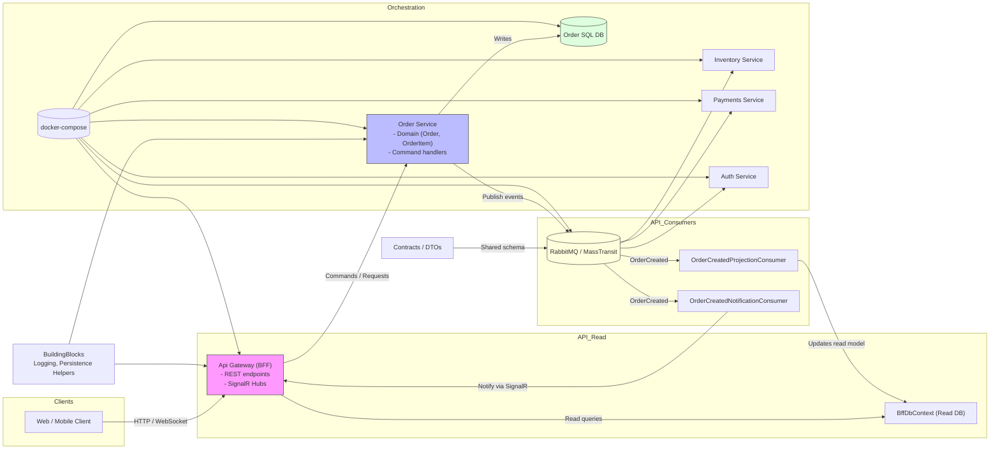

# Architecture Diagram

This file contains a Mermaid diagram representing the high-level architecture of the `EmberOps` solution. You can view the rendered diagram on GitHub (or any tool that supports Mermaid).

Short description

- `Api Gateway` (BFF) exposes REST endpoints and SignalR hubs to clients, hosts read-models (BffDbContext) for queries and consumes integration events.
- `Order Service` contains domain logic (orders, items), persists data to `Order SQL DB`, and publishes domain events via RabbitMQ/MassTransit.
- `RabbitMQ / MassTransit` is the message broker used for integration events (e.g. `OrderCreated`).
- Other services (Inventory, Payments, Auth) subscribe to events from the bus.
- `BuildingBlocks` contains shared helpers (logging, persistence, interceptors) used across services.
- `docker-compose` orchestrates local infrastructure (broker, databases, services).

Notes

- The diagram focuses on data and messaging flows. For deployment diagrams (Kubernetes, containers, scaling) create a separate view.
- To render the diagram, open this file on GitHub or paste the Mermaid block into a Mermaid live editor.
