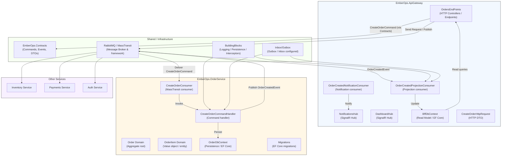

# Components Diagram

This file contains a Mermaid component-style diagram describing the main components in the EmberOps solution and how they interact. Render the Mermaid block in a Mermaid-capable viewer (GitHub, Mermaid Live Editor) to see the diagram.

Short explanation

- The `ApiGateway` project exposes HTTP endpoints (`OrdersEndPoints`) and SignalR hubs (`NotificationsHub`, `DashboardHub`). It maintains a read model via `BffDbContext` and consumes integration events to keep projections and push notifications.
- The `OrderService` contains the domain model (`Order`, `OrderItem`), the command handler (`CreateOrderCommandHandler`), MassTransit consumer (`CreateOrderConsumer`), and persistence (`OrderDbContext`, migrations).
- `EmberOps.Contracts` holds shared commands, events and DTOs used across services.
- `BuildingBlocks` contains cross-cutting concerns like logging, EF Core interceptors (auditing), and persistence helpers used by services.
- `RabbitMQ / MassTransit` is the message bus used to send commands and publish integration events. Other services (Inventory, Payments, Auth) subscribe to those events.

How to view

- Open this file on GitHub to render the Mermaid diagram, or paste the Mermaid block into a Mermaid Live Editor.
