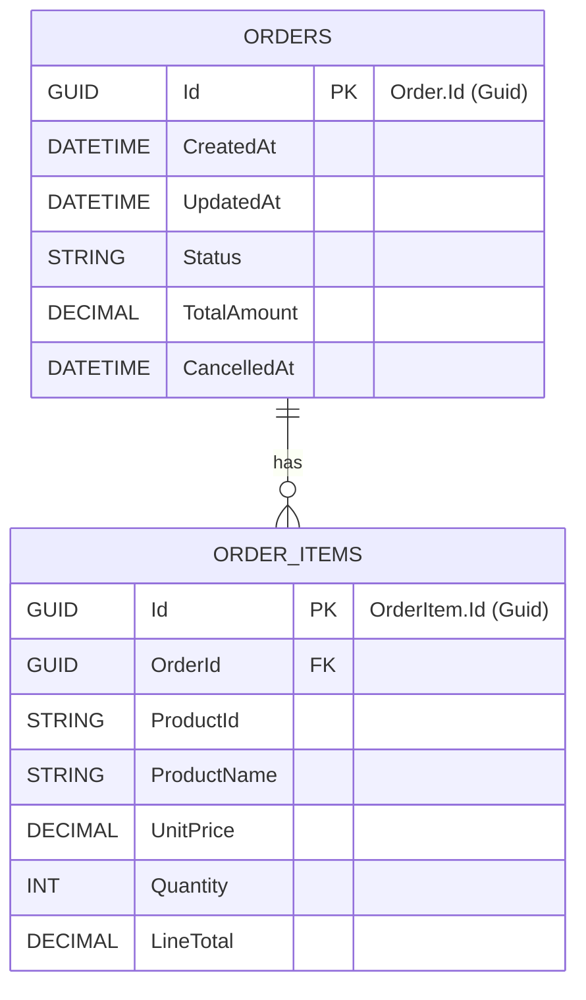
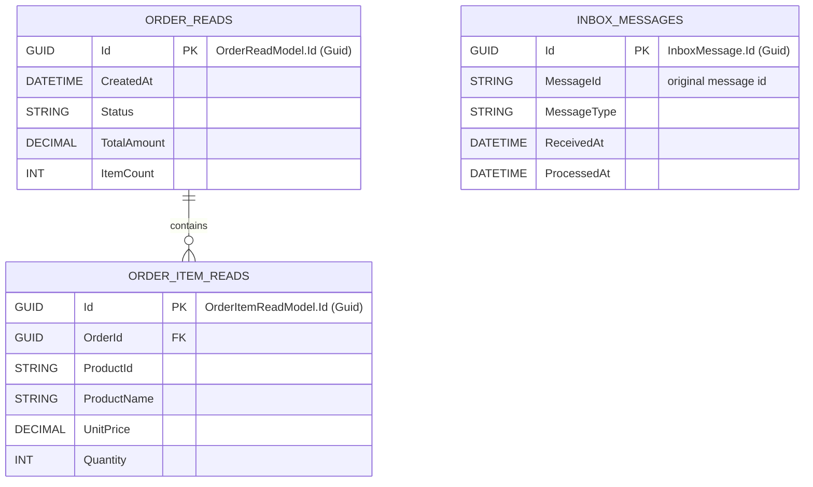

# Database Diagrams

This document contains Mermaid ER diagrams for the main persistence contexts in the solution: the `Order` write database (Order Service) and the `BFF` read database (API Gateway).

Note: these diagrams are inferred from the project's domain and read-model classes (`Order`, `OrderItem`, `OrderReadModel`, `OrderItemReadModel`, `InboxMessage`). Adjust fields to match the exact schema in your `DbContext`/migrations if needed.

## Order Service (write DB)

Short notes:
- `ORDERS.TotalAmount` is typically derived as the sum of `ORDER_ITEMS.LineTotal`.
- `ORDER_ITEMS.LineTotal` = `UnitPrice * Quantity` (may be stored or calculated).
- Additional audit fields (CreatedBy/UpdatedBy) may exist depending on `IAuditable` interceptors.

## BFF Read Model (API Gateway)

Short notes:
- The BFF read model is populated from integration events (e.g., `OrderCreatedIntegrationEvent`) by projection consumers.
- `INBOX_MESSAGES` is used by inbox/outbox processing to ensure idempotent handling of integration events.

## How to update these diagrams

- If you want field-level accuracy, open the entity and configuration classes under `EmberOps.OrderService/Domain` and `EmberOps.ApiGateway/Application/ReadModels`, then update the corresponding table definitions above.
- To visualize locally, paste the Mermaid blocks into a Mermaid live editor or view the files on GitHub (which renders Mermaid in markdown).

