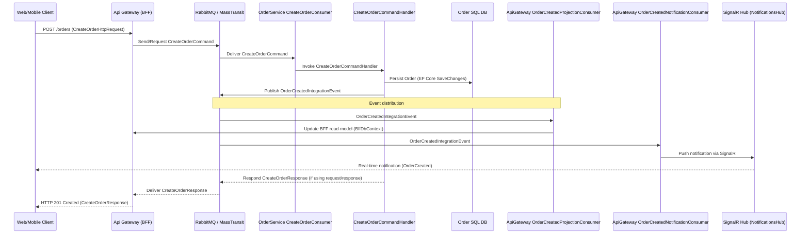

# Sequence Diagram: Create Order Command Flow

This file contains a Mermaid sequence diagram that shows the command flow when a client creates an order in the EmberOps solution.

Notes

- The API Gateway may use MassTransit's request/response pattern to wait for a `CreateOrderResponse` before returning an HTTP response. If not, it can return immediately with 202 Accepted while the command is processed asynchronously.
- `OrderCreatedIntegrationEvent` is consumed by API Gateway projection consumer to keep the read-model in sync and by a notification consumer to push real-time updates to connected clients via SignalR.
- Persistence occurs inside the Order Service domain (EF Core) during command handling.

To render the diagram copy the Mermaid block into a Mermaid renderer or view this file on GitHub.
