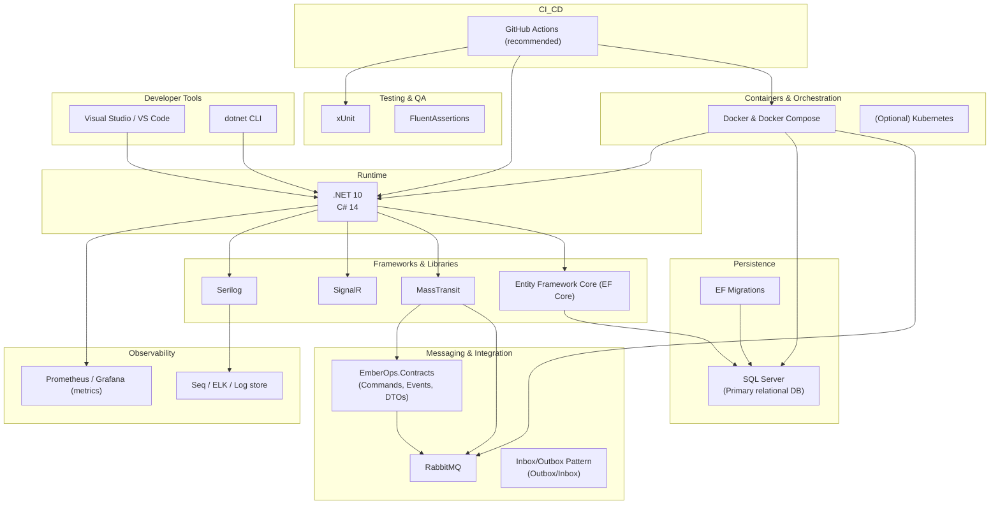

# Tech Stack

This file shows the primary technologies, libraries, and infrastructure used across the `EmberOps` solution. Render the Mermaid block in a Mermaid-capable viewer (GitHub, Mermaid Live Editor) to see the diagram.

Short notes

- Runtime: the solution targets `dotnet 10` and leverages C# 14 language features.
- Core frameworks: `EF Core` for persistence, `MassTransit` + `RabbitMQ` for messaging, `SignalR` for real-time notifications, and `Serilog` for structured logging.
- Persistence: SQL Server is used as the primary relational database; EF Core migrations are included in service projects.
- Messaging: domain commands/events are defined in `EmberOps.Contracts` and exchanged over RabbitMQ using MassTransit. The Inbox/Outbox pattern is used where applicable.
- Containers: Docker and `docker-compose` orchestrate local development. Services can be deployed to Kubernetes in production.
- Testing: unit tests use `xUnit` and `FluentAssertions` (see `EmberOps.OrderService.Tests`).
- CI/CD: recommend `GitHub Actions` (adjust to your CI provider).
- Observability: Serilog sinks to log stores (Seq/ELK) and metrics pipelines (Prometheus/Grafana) are recommended.

To render the diagram, open this file on GitHub or paste the Mermaid block into a Mermaid live editor.
